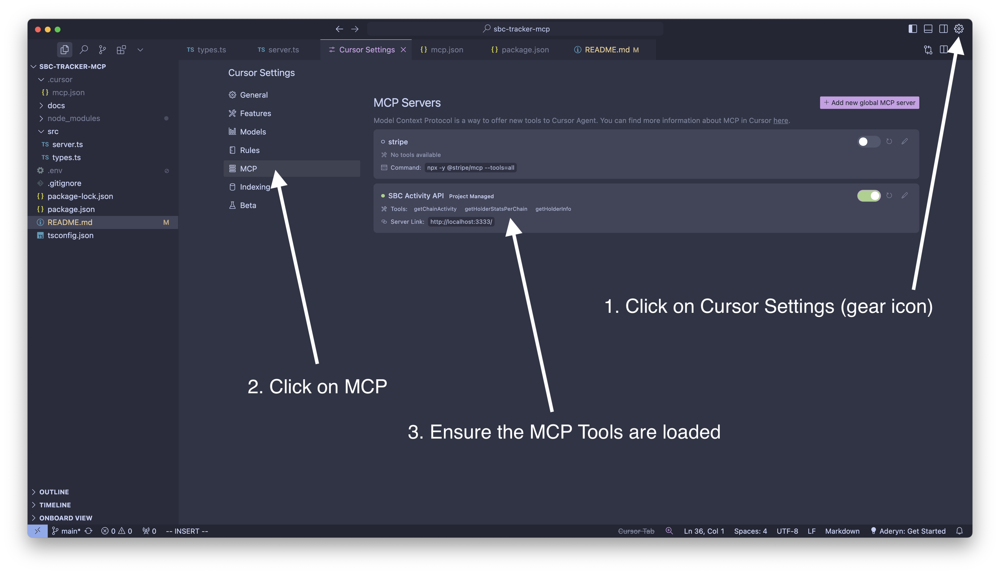

# MCP Server Demo (using Activity API)

An MCP server that wraps around an "Activity API" service that provides blockchain activity and holder information for SBC (Stablecoin).

## Installation

```bash
npm install
```

## Configuration

Create a `.env` file with:

```
API_URL="The Activity API URL"
API_KEY="Your API Key"
```

## Usage

Start the MCP server:

```bash
npm run start
```

The server runs on port 3333 and provides the following MCP tools that maps to 3 of [Activity API](https://github.com/stablecoinxyz/activity-api) endpoints:

- `getChainActivity` - Get blockchain activity information for a specific chain
- `getHolderStatsPerChain` - Get holder counts across different chains
- `getHolderInfo` - Get holder information by wallet address 

Configure the MCP Client (i.e. Cursor):

Create a directory called `.cursor` and add a file called `mcp.json` with the following content

```
{
  "mcpServers": {
    "SBC Activity API": {
      "type": "sse",
      "url": "http://localhost:3333/"
    }
  }
}
```

Open Cursor Settings and verify Tools are loaded.




